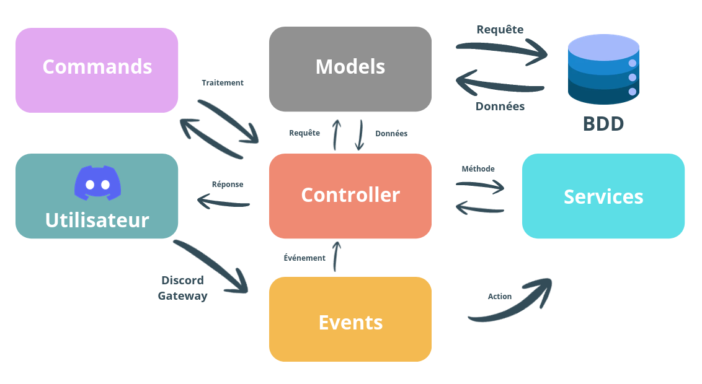
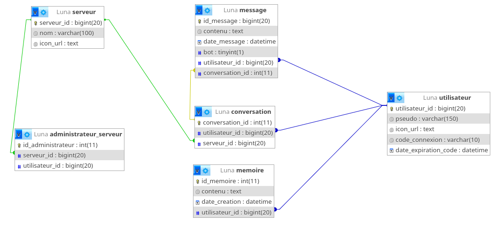

<div align="center">
    
</div>

<h1 align="center">Projet - Bot Discord</h1>

Luna est un bot Discord refait en **TypeScript**. Le code source est organisé dans `src/`, compilé vers `dist/`, puis lancé depuis le build généré.

[Lien d'installation Discord](https://discord.com/oauth2/authorize?client_id=1438539563487465532)

<h2 align="center">Prérequis</h2>

- **Node.js** 20 ou plus récent
- **npm**
- **Compte Discord**
- **Clé API Groq**
- **Base MySQL** compatible avec le schéma du projet

<h2 align="center">Structure TypeScript</h2>

Le projet utilise ces fichiers à la racine du projet local pour compiler et exécuter le bot :

- `package.json` pour les scripts et dépendances
- `tsconfig.json` pour la configuration TypeScript
- `src/` pour le code source
- `dist/` pour le résultat de compilation

Si ton dépôt GitHub ne publie que `src/`, garde quand même `package.json` et `tsconfig.json` à la racine du projet local. Sans eux, TypeScript ne peut pas compiler correctement.

### Configuration TypeScript recommandée

Le projet est prévu pour cette configuration :

tsconfig.json
```json
{
  "compilerOptions": {
    "rootDir": "./src",
    "outDir": "./dist",

    "module": "nodenext",
    "moduleResolution": "nodenext",
    "target": "esnext",
    "types": ["node"],

    "sourceMap": true,
    "declaration": true,
    "declarationMap": true,

    "checkJs": false,

    "noUncheckedIndexedAccess": true,
    "exactOptionalPropertyTypes": true,

    "strict": true,
    "verbatimModuleSyntax": true,
    "isolatedModules": true,
    "noUncheckedSideEffectImports": true,
    "moduleDetection": "force",
    "skipLibCheck": true,
    "resolveJsonModule": true,
    "allowSyntheticDefaultImports": true
  },
  "include": ["src/**/*"],
  "exclude": ["dist", "node_modules"]
}
```

package.json
```json
{
  "name": "luna",
  "version": "1.0.0",
  "type": "module",
  "description": "Discord bot",
  "main": "dist/index.js",
  "scripts": {
    "dev": "tsx watch src/index.ts",
    "build": "tsc -p tsconfig.json",
    "start": "node dist/index.js"
  },
  "dependencies": {
    "discord.js": "^14.26.4",
    "dotenv": "^17.4.2",
    "groq": "^5.31.1",
    "groq-sdk": "^0.37.0",
    "mysql2": "^3.22.6"
  },
  "devDependencies": {
    "@types/node": "^26.1.1",
    "ts-node": "^10.9.2",
    "tsx": "^4.23.1",
    "typescript": "^7.0.2"
  }
}
```

Une fois la migration terminée, tu peux désactiver `allowJs` pour forcer uniquement le code TypeScript.

<h2 align="center">Installation</h2>

### 1. Cloner le projet

```bash
git clone https://github.com/Tiago-170/Luna.git
```

### 2. Installer les dépendances

```bash
npm install discord.js, dotenv, groq, mysql2, groq-sdk

npx tsc --init
```

### 3. Configurer les variables d'environnement

Crée un fichier `.env` à la racine du projet :

```env
TOKEN=
CLIENT_ID=

GROK_API_1=

DB_HOST=
DB_USERNAME=
DB_PASSWORD=
DB_NAME=
```

### 4. Compiler le projet

```bash
npm run build
```

TypeScript compile `src/` vers `dist/` avec la configuration de `tsconfig.json`.

### 5. Lancer le bot

```bash
npm start
```

<h2 align="center">Scripts</h2>

Dans `package.json` :

```json
{
  "dev": "tsx watch src/index.ts",
  "build": "tsc -p tsconfig.json",
  "start": "node dist/index.js"
}
```

<h2 align="center">Architecture du projet</h2>

Ce projet utilise une **architecture MVC modifiée** en TypeScript pour correspondre aux besoins spécifiques du bot Discord.



### Structure des dossiers

```
├── index.ts                   # Point d'entrée
├── core/                      # Cœur du framework
│   ├── Client.ts              # Configuration Discord.js
│   ├── Command.ts             # Gestion des commandes /
│   ├── Controller.ts          # Contrôleur de base
│   ├── Database.ts            # Gestion de la bdd
│   ├── Model.ts               # Modèle de base
│   └── Router.ts              # Routeur d'événements
├── controllers/               # Contrôleurs de l'app
├── models/                    # Modèles de données
├── services/                  # Services métier
├── events/                    # Gestion d'événements
│   └── readyEvent.ts          # Événement de démarrage
└── variable/                  # Variables globales
  └── system_prompt.ts       # Prompt système pour l'IA
```

<h2 align="center">Base de données</h2>

<div align="center">
    
</div>

```sql
SET SQL_MODE = "NO_AUTO_VALUE_ON_ZERO";
START TRANSACTION;
SET time_zone = "+00:00";

CREATE TABLE `administrateur_serveur` (
  `id_administrateur` int(11) NOT NULL,
  `serveur_id` bigint(20) NOT NULL,
  `utilisateur_id` bigint(20) NOT NULL
) ENGINE=InnoDB DEFAULT CHARSET=utf8mb4 COLLATE=utf8mb4_general_ci;

CREATE TABLE `comptage` (
  `salon_id` bigint(20) NOT NULL,
  `nombre` int(11) DEFAULT 0,
  `actif` tinyint(1) NOT NULL DEFAULT 1,
  `utilisateur_id` bigint(20) DEFAULT NULL,
  `serveur_id` bigint(20) NOT NULL
) ENGINE=InnoDB DEFAULT CHARSET=utf8mb4 COLLATE=utf8mb4_general_ci;

CREATE TABLE `conversation` (
  `conversation_id` int(11) NOT NULL,
  `utilisateur_id` bigint(20) DEFAULT NULL,
  `serveur_id` bigint(20) DEFAULT NULL
) ENGINE=InnoDB DEFAULT CHARSET=utf8mb4 COLLATE=utf8mb4_general_ci;

CREATE TABLE `memoire` (
  `id_memoire` int(11) NOT NULL,
  `contenu` text NOT NULL,
  `date_creation` datetime NOT NULL DEFAULT current_timestamp(),
  `utilisateur_id` bigint(20) DEFAULT NULL
) ENGINE=InnoDB DEFAULT CHARSET=utf8mb4 COLLATE=utf8mb4_general_ci;

CREATE TABLE `message` (
  `id_message` bigint(20) NOT NULL,
  `contenu` text DEFAULT NULL,
  `date_message` datetime NOT NULL DEFAULT current_timestamp(),
  `bot` tinyint(1) NOT NULL,
  `utilisateur_id` bigint(20) DEFAULT NULL,
  `conversation_id` int(11) NOT NULL
) ENGINE=InnoDB DEFAULT CHARSET=utf8mb4 COLLATE=utf8mb4_general_ci;

CREATE TABLE `serveur` (
  `serveur_id` bigint(20) NOT NULL,
  `nom` varchar(100) NOT NULL,
  `icon_url` text DEFAULT NULL
) ENGINE=InnoDB DEFAULT CHARSET=utf8mb4 COLLATE=utf8mb4_general_ci;

CREATE TABLE `utilisateur` (
  `utilisateur_id` bigint(20) NOT NULL,
  `pseudo` varchar(150) NOT NULL,
  `icon_url` text DEFAULT NULL,
  `code_connexion` varchar(10) DEFAULT NULL,
  `date_expiration_code` datetime DEFAULT NULL
) ENGINE=InnoDB DEFAULT CHARSET=utf8mb4 COLLATE=utf8mb4_general_ci;

ALTER TABLE `administrateur_serveur`
  ADD PRIMARY KEY (`id_administrateur`),
  ADD UNIQUE KEY `id_administrateur` (`id_administrateur`),
  ADD UNIQUE KEY `uq_admin_serveur` (`serveur_id`,`utilisateur_id`),
  ADD KEY `idx_utilisateur_id` (`utilisateur_id`);

ALTER TABLE `comptage`
  ADD PRIMARY KEY (`salon_id`),
  ADD UNIQUE KEY `serveur_id_1` (`serveur_id`),
  ADD KEY `utilisateur_id_1` (`utilisateur_id`);

ALTER TABLE `conversation`
  ADD PRIMARY KEY (`conversation_id`),
  ADD KEY `utilisateur_id` (`utilisateur_id`),
  ADD KEY `serveur_id` (`serveur_id`);

ALTER TABLE `memoire`
  ADD PRIMARY KEY (`id_memoire`),
  ADD UNIQUE KEY `utilisateur_id` (`utilisateur_id`);

ALTER TABLE `message`
  ADD PRIMARY KEY (`id_message`),
  ADD KEY `utilisateur_id` (`utilisateur_id`),
  ADD KEY `conversation_id` (`conversation_id`);

ALTER TABLE `serveur`
  ADD PRIMARY KEY (`serveur_id`);

ALTER TABLE `utilisateur`
  ADD PRIMARY KEY (`utilisateur_id`);

ALTER TABLE `administrateur_serveur`
  MODIFY `id_administrateur` int(11) NOT NULL AUTO_INCREMENT, AUTO_INCREMENT=430;

ALTER TABLE `conversation`
  MODIFY `conversation_id` int(11) NOT NULL AUTO_INCREMENT, AUTO_INCREMENT=2;

ALTER TABLE `memoire`
  MODIFY `id_memoire` int(11) NOT NULL AUTO_INCREMENT, AUTO_INCREMENT=73;

ALTER TABLE `administrateur_serveur`
  ADD CONSTRAINT `administrateur_serveur_ibfk_1` FOREIGN KEY (`serveur_id`) REFERENCES `serveur` (`serveur_id`) ON DELETE CASCADE,
  ADD CONSTRAINT `administrateur_serveur_ibfk_2` FOREIGN KEY (`utilisateur_id`) REFERENCES `utilisateur` (`utilisateur_id`) ON DELETE CASCADE ON UPDATE CASCADE;

ALTER TABLE `comptage`
  ADD CONSTRAINT `serveur_id_2` FOREIGN KEY (`serveur_id`) REFERENCES `serveur` (`serveur_id`) ON DELETE CASCADE ON UPDATE CASCADE,
  ADD CONSTRAINT `utilisateur_id_1` FOREIGN KEY (`utilisateur_id`) REFERENCES `utilisateur` (`utilisateur_id`) ON DELETE CASCADE ON UPDATE CASCADE;

ALTER TABLE `conversation`
  ADD CONSTRAINT `conversation_ibfk_1` FOREIGN KEY (`utilisateur_id`) REFERENCES `utilisateur` (`utilisateur_id`),
  ADD CONSTRAINT `conversation_ibfk_2` FOREIGN KEY (`serveur_id`) REFERENCES `serveur` (`serveur_id`);

ALTER TABLE `memoire`
  ADD CONSTRAINT `memoire_ibfk_1` FOREIGN KEY (`utilisateur_id`) REFERENCES `utilisateur` (`utilisateur_id`);

ALTER TABLE `message`
  ADD CONSTRAINT `message_ibfk_1` FOREIGN KEY (`utilisateur_id`) REFERENCES `utilisateur` (`utilisateur_id`),
  ADD CONSTRAINT `message_ibfk_2` FOREIGN KEY (`conversation_id`) REFERENCES `conversation` (`conversation_id`);
COMMIT;
```
